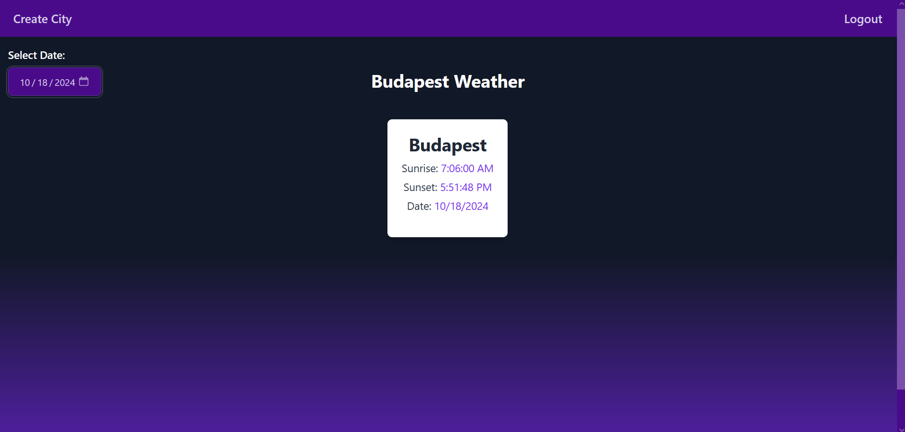

# Welcome to the SolarWatch Project Repository!

SolarWatch is a full-stack application that uses Spring Boot for the backend to display the sunrise and sunset times for the selected city. This project showcases best practices in full-stack development, including containerization, database integration, user authentication, and frontend development with React.

## Table of Contents
- [Overview](#overview)
- [Technologies](#technologies)
- [Getting Started](#getting-started)
  - [Docker Setup](#docker-setup)
  - [Prerequisites](#prerequisites)
  - [Installation](#installation)
- [Features](#features)
  - [User Management](#user-management)
  - [Frontend Integration](#frontend-integration)
- [Usage](#usage)

## Overview
SolarWatch began as a simple Spring Boot Web API project and has evolved into a full-featured application with the following enhancements:

  - MVC Architecture: Utilizes the Spring MVC framework for a complete UI and API integration.
  - Dockerization: Containerized using Docker for seamless deployment and environment management.
  - Database Integration: Uses PostgreSQL to minimize dependency on external APIs.
  - User Management: Incorporates Spring Security for user authentication and authorization.

## Technologies
Technologies used in this application:
  - Backend:
    - [![spring-boot][spring-boot]][spring-boot-url]
    - [![spring-web-mvc][spring-web-mvc]][spring-web-mvc-url]
    - [![spring-data-jpa][spring-data-jpa]][spring-data-jpa-url]
    - [![spring-security][spring-security]][spring-security-url]
    - [![hibernate][hibernate]][hibernate-url]
    - [![postgresql][postgresql]][postgresql-url]
  - Frontend:
    - [![react.js][react.js]][react-url]
    - [![css3][css3]][css3-url]
  - Containerization:
    - [![docker][docker]][docker-url]


## Getting Started
### Docker Setup
The application is fully containerized using Docker. If you prefer containerized deployment, follow the steps below to run the application using Docker. Otherwise, you can manually install the backend and frontend by following the instructions in the [Installation](#installation) section.

- To run the application with Docker Compose:
  - Set environment variables in `docker-compose.yaml`.
    ```bash
    # db env variables
    POSTGRES_DB=YOUR_DB_NAME
    POSTGRES_USER=YOUR_DB_USERNAME
    POSTGRES_PASSWORD=YOUR_DB_PASSWORD

    ## backend env variables
    SPRING_DATASOURCE_URL=jdbc:postgresql://postgres:5432/YOUR_DB_NAME
    SPRING_DATASOURCE_USERNAME=YOUR_DB_USERNAME
    SPRING_DATASOURCE_PASSWORD=YOUR_DB_PASSWORD
    API_KEYCITY=YOUR_API_KEY
    ```
  - Build and start the containers:
    ```bash
    docker compose up --build
    ```

### Prerequisites
Ensure the following are installed:
- [![java][java]][java-url]
- [![maven][maven]][maven-url]
- [![postgresql][postgresql]][postgresql-url]
- [![nodejs][node.js]][node-url]
- [![npm][npm]][npm-url]

 ### Installation
  If you're not using Docker, follow these steps to manually install and set up the project locally:
1. Clone the repository from GitHub:
   ```bash
    git clone git@github.com:CodecoolGlobal/solar-watch-MVP-java-Vazul15.git

    # navigate into the project directory
    cd solarWatch-MVP
   ```

2. Backend Setup:
   - Navigate to the backend directory:
     ```bash
      cd backend
     ```

   - Build the project:
     ```bash
      mvn clean install
     ```

   - Set environment variables:
     - Option 1: Using PowerShell
       ```bash
        $env:API_KEY="YOUR_API_KEY"
        $env:DATABASE_URL="jdbc:postgresql://localhost:5432/solarwatch"
        $env:DATABASE_USERNAME="YOUR_DATABASE_USERNAME"
        $env:DATABASE_PASSWORD="YOUR_DATABASE_PASSWORD"
       ```

     - Option 2: Using Command Prompt
       ```bash
        set API_KEY=YOUR_API_KEY
        set DATABASE_URL=jdbc:postgresql://localhost:5432/solarwatch
        set DATABASE_USERNAME=YOUR_DATABASE_USERNAME
        set DATABASE_PASSWORD=YOUR_DATABASE_PASSWORD
       ```

   - Run the application:
     ```bash
      mvn spring-boot:run
     ```

3. Frontend Setup:
   - Navigate to the frontend directory:
     ```bash
      cd frontend
     ```

   - Install dependencies:
     ```bash
      npm install
     ```

   - Start the development server:
       ```bash
        npm run dev
       ```

## Features
  ### User Management
  - Handles user authentication and authorization via Spring Security.
  - Features include:
    - User Registration: Allows new users to sign up.
    
    - Authentication: Users log in to receive a JWT token.
    
    - Authorization: Secures endpoints to authenticated users.

  ### Frontend Integration
  - Built with React-Vite to interact with the SolarWatch API.
  - Features include:
    - City Search: Users can query sunrise and sunset times.
    
    - Create City: Only Admin can create cities.
    
    -Display City Sunset and Sunrise: Show demanded city sundrise and sunset in the choosen date.
    

## Usage
Using SolarWatch:
  - Register an Account: Sign up to create a new account.
  - Log In: Use your credentials to log in.
  - Search for a City: On the main page, search for a city to retrieve sunrise and sunset times.


[spring-boot]: https://img.shields.io/badge/SpringBoot-6DB33F?style=for-the-badge&logo=Spring&logoColor=white
[spring-boot-url]: https://spring.io/projects/spring-boot
[spring-web-mvc]: https://img.shields.io/badge/SPRING%20WEB%20MVC-6DB33F?style=for-the-badge&logo=Spring&logoColor=white
[spring-web-mvc-url]: https://docs.spring.io/spring-framework/reference/web/webmvc.html
[spring-data-jpa]: https://img.shields.io/badge/SPRING%20DATA%20JPA-6DB33F?style=for-the-badge&logo=Spring&logoColor=white
[spring-data-jpa-url]: https://spring.io/projects/spring-data-jpa
[spring-security]: https://img.shields.io/badge/Spring%20Security-6DB33F?style=for-the-badge&logo=springsecurity&logoColor=white
[spring-security-url]: https://spring.io/projects/spring-security
[hibernate]: https://img.shields.io/badge/Hibernate-59666C?style=for-the-badge&logo=hibernate&logoColor=white
[hibernate-url]: https://hibernate.org/
[postgresql]: https://img.shields.io/badge/postgresql-4169e1?style=for-the-badge&logo=postgresql&logoColor=white
[postgresql-url]: https://www.postgresql.org/
[react.js]: https://img.shields.io/badge/React-20232A?style=for-the-badge&logo=react&logoColor=61DAFB
[react-url]: https://reactjs.org/
[CSS3]: https://img.shields.io/badge/CSS3-blue?style=for-the-badge
[CSS3-url]: https://developer.mozilla.org/en-US/docs/Web/CSS
[docker]: https://img.shields.io/badge/Docker-2496ED?style=for-the-badge&logo=docker&logoColor=white
[docker-url]: https://www.docker.com/
[github-actions]: https://img.shields.io/badge/GitHub_Actions-2088FF?style=for-the-badge&logo=github-actions&logoColor=white
[github-actions-url]: https://docs.github.com/en/actions
[java]: https://img.shields.io/badge/Java-17%2B-ED8B00?style=for-the-badge&labelColor=ED8B00&logo=java&color=808080[Java
[java-url]: https://www.java.com/en/
[maven]: https://img.shields.io/badge/Maven-4%2B-ED8B00?style=for-the-badge&labelColor=ED8B00&logo=maven&color=808080[Maven
[maven-url]: https://maven.apache.org/
[node.js]: https://img.shields.io/badge/Node.js-339933?style=for-the-badge&logo=nodedotjs&logoColor=white
[node-url]: https://nodejs.org/en
[npm]: https://img.shields.io/badge/npm-CB3837?style=for-the-badge&logo=npm&logoColor=white
[npm-url]: https://www.npmjs.com/